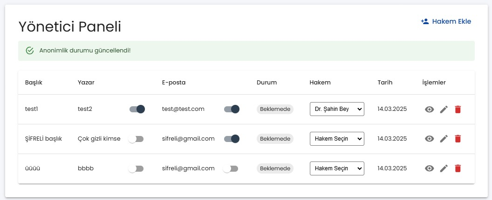
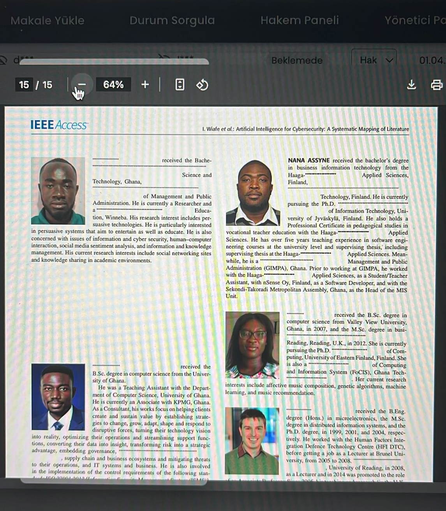

Kocaeli Üniversitesi Bilgisayar Mühendisliği
2024-2025 Bahar Dönemi
Yazılım Lab.II
Proje I

Güvenli Belge Anonimleştirme Sistemi

Proje Başlangıç Tarihi .......................................................................... .03 Mart 2025
Proje Bitiş Tarihi ....................................................................................28 Mart 2025

Proje Tanımı: Bu proje, akademik makale yükleme ve değerlendirme sisteminin
geliştirilmesini hedeflemektedir. Kullanıcılar makalelerini yükleyebilir, hakemler
anonim şekilde değerlendirme yapabilir ve yöneticiler sonuçları yönetebilir.

1. Kullanıcı Türleri: Kullanıcı (Yazar), Yönetici (Editör) ve Değerlendirici (Hakem)

 Kullanıcı (Yazar):
▪ Kullanıcı sisteme üye olmadan makale yükleyebilmelidir.
▪ Yükleme sırasında geçerli bir e-posta adresi girmesi zorunludur.
▪ Yükleme tamamlandığında kullanıcıya eşsiz bir makale takip numarası
verilir.
▪ Akademik makalesini PDF formatında sisteme yükler.
▪ Editöre mesaj gönderebilir.
▪ Değerlendirme sürecini takip eder.
▪ Sonuçları ve hakem geri bildirimlerini alır.
▪ Gerekirse revize edilmiş makaleyi tekrar yükler
 
 
 Yönetici (Editör):
▪ Sisteme yüklenen makalelerin tümünü görüntüleyebilir.
▪ Makalenin anahtar kelimelerine göre alan ataması yapar.
▪ Makale içeriğindeki tüm yazar ve kurum bilgilerini otomatik tespit
edilir.
▪ Yönetici anonimleştirilecek bilgileri seçer.
▪ Anonimleştirilmiş makaleleri indirebilir.
▪ Anonimleştirilmiş makaleleri alandaki uygun hakemlere yönlendirir.
▪ Hakem değerlendirmelerini alır ve yazar bilgilerini geri yükleyerek
(anonimleştirilen kısımları orijinal haline dönüştürerek) sonucu yazara
iletir.
▪ Hakem değerlendirmeleri Editör tarafından değiştirilemez olmalı.
▪ Sürecin düzgün ilerlemesini sağlar ve gerektiğinde hakem değişikliği
yapar.
▪ Anonimleştirilmiş belgenin ilgili taraflara güvenli iletiminden
sorumludur.
▪ Sistemde tutulan makalelerin log kaydını inceleyebilecektir. (Editöre …
tarihinde geldi, … hakeme atandı, hakem … tarihinde cevap verdi, ..
yayınlandı gibi)
 
 
 Değerlendirici (Hakem):
▪ Anonimleştirilmiş makaleleri inceleyerek değerlendirme yapar.
▪ Yaptığı değerlendirmeleri sisteme yükler ve gerekirse ek açıklamalar
ekler.

2. Uygulama Linkleri (Örnek): Web uygulaması için örnek sayfa linkleri aşağıda
verilmiştir.
 Makale Yükleme Sayfası: https://makalesistemi
▪ E-posta al
▪ PDF yükleme alanı
▪ E-posta doğrulama mekanizması (Uygun e-posta adresi formatı)
 Makale Durumu Sorgulama Formu: https://makaledurumsorgulama
▪ Makale takip numarası
▪ E-posta alanı
 Yönetici Paneli: https://makalesistemi/yonetici
 Hakem Paneli: https://makalesistemi/degerlendirici

3. Teknik Gereksinimler:
 Veri Saklama ve Güvenliği İçin Şifreleme Yöntemleri: AES, RSA,
SHA-256 vb.
 Anonimleştirilmesi Gereken Bilgilerin Tespiti: Regex, NER vb.
 Veri Tabanı: herhangi bir kısıt bulunmamaktadır.
 Programlama dili : Python (Django/Flask), Node.js (Express.js), Java
(Spring Boot), C# (ASP.NET Core), PHP; React.js, Angular.

4. Dikkat Edilmesi Gerekenler:
 Hakemler, editörün anonimleştirdiği bilgileri hiçbir şekilde görmemesi
gerekmektedir.
 Editör anonimleştirilen bilgilerden istediklerini orijinal haline getirerek
pdf’i düzenleyebilir.
 Hakemlere anonimleştirilen makaleler pdf şeklinde gelecektir. Sistem daha
sonra hakem yorumlarını yorum alanına ekleyerek ve makale pdf’inin
sonuna ekleyerek tek bir pdf halinde Editöre gönderecektir.
 Hakem değerlendirmeleri Editör tarafından değiştirilemez olmalı (Önemli).
 Değerlendirme sonuçlarını Hakem tarafından Editöre, Editör de yazara iletir.
 Her makale Editör tarafından sadece bir Hakem’e gön
 Kullanıcı makale takip numarası ile yüklediği makalesi hakkında durum
kontrolü yapacaktır. Editörle mesajlaşmayı da bu arayüzden
gerçekleştirecektir.

 
 Anonimleştirmede kullanılacak seçenekler:
▪ Yazar Ad-Soyad
▪ Yazar iletişim bilgileri
▪ Yazar kurum bilgileri
 
 
 Anonimleştirmede dikkat edilmesi gerekenler:
▪ Kurum bilgileri makalenin içerisinde de yer alabilir. Burada makale
içerisinde farklı bir anlamda kullanılan kurum bilgisinin
anonimleştirilmemesi gerekmektedir.
▪ “Giriş”, “İlgili çalışmalar”, “Referanslar” ve “Teşekkür” bölümlerinde
yazar isimleri bulunacağı için anonimleştirme yapılırken bunların da
anonimleştirilmemesi gerekmektedir.
▪ Anonileştirme için hazır yapay zeka apileri kullanılmayacaktır. Kullanan
kişiler yalnızca arayüzlerden puan alabilecektir.
 Makalede yazarlara ait anonimleştirilmesi gereken görüntüler blur olmalıdır.
Diğer bilgiler sizin belirleyeceğiniz referans kodları veya “*” ile
anonimleştirilmelidir.
 
 
 Sunum esnasındaki işleyiş için hakem, editör ve kullanıcı için giriş şifre vs.
işlemleri kesinlikle olmayacaktır. Giriş kontrolleri olan projelerden not
kırılacaktır.

